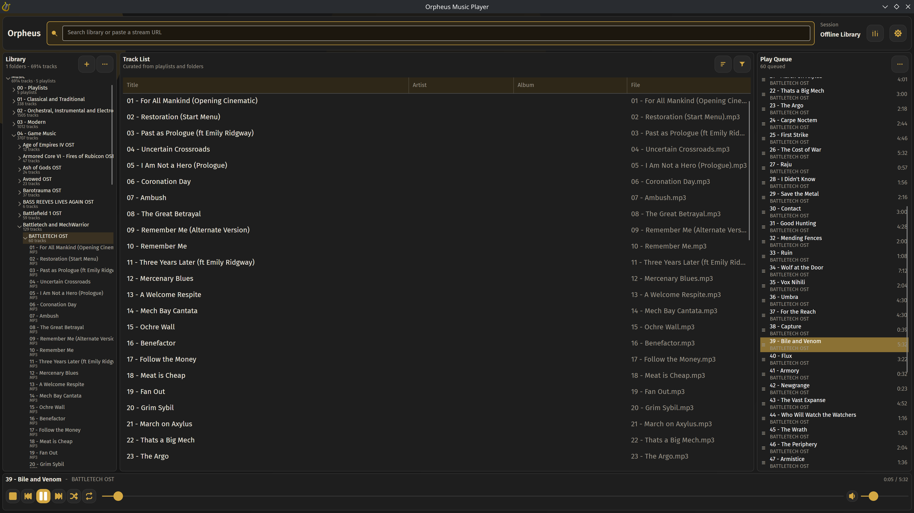

<p align="center">
  
</p>

# Orpheus Music Player

A modern music player for listening to local and network-shared libraries. Built with [Avalonia UI](https://avaloniaui.net/) and [LibVLC](https://www.videolan.org/vlc/libvlc.html), targeting Windows, macOS, Linux, and Android.



## Features

- **Media library** — scan local and network folders; SQLite-backed with full tag support via TagLib
- **10-band equalizer** — per-band gain, preamp, and 12 built-in presets
- **Global hotkeys** — configurable keyboard, mouse button, and scroll wheel shortcuts that work when the app is in the background; media keys supported out of the box
- **MPRIS2** (Linux) — full D-Bus media player interface; works with `playerctl`, KDE Plasma, and GNOME shell
- **Custom themes** — swap color variants or drop in your own palette overrides without replacing the full theme
- **System tray** — optional minimize-to-tray on close
- **Configurable track list** — show/hide columns per your preference (title, artist, album, format, bitrate, and more)

## Supported Formats

MP3, FLAC, OGG, Opus, AAC/M4A, WAV, WMA, AIFF, APE, WavPack, MKA

## Platforms

| Platform | Minimum Version |
|---|---|
| Windows | 10 |
| macOS | 12 (Monterey) |
| Linux | Any — requires system `libvlc` (`vlc` package) |
| Android | 8.0 (API 26) |

## Themes

Orpheus ships with the **Muse** layout and five color variants:

| Variant | Accent |
|---|---|
| Muse (default) | Warm gold `#D4A843` |
| Ember | Copper `#C87533` |
| Berry | Coral red `#E65B6C` |
| Midnight | Cornflower blue `#5B8FE6` |
| Plum | Violet `#A855F7` |

Drop a `Muse.usercolors.axaml` file into your config directory to override any palette key without touching the built-in files. Additional layout themes can be placed in the `layouts/` subfolder of your config directory and are picked up automatically at startup.

**Config directory locations:**

| OS | Path |
|---|---|
| Linux | `~/.config/OrpheusMP/` |
| macOS | `~/Library/Application Support/OrpheusMP/` |
| Windows | `%APPDATA%\OrpheusMP\` |

## Tech Stack

- [.NET 10](https://dotnet.microsoft.com/) / C#
- [Avalonia UI 11](https://avaloniaui.net/) — cross-platform XAML UI framework
- [LibVLCSharp](https://github.com/videolan/libvlcsharp) — audio playback via LibVLC
- [SQLite](https://www.sqlite.org/) via `Microsoft.Data.Sqlite` — media library storage
- [TagLibSharp](https://github.com/mono/taglib-sharp) — audio tag reading
- [SharpHook](https://github.com/TolikPylypchuk/SharpHook) — global hotkeys (desktop)
- [Tmds.DBus](https://github.com/tmds/Tmds.DBus) — MPRIS2 D-Bus integration (Linux)

## Installation

Pre-built releases are available on the [Releases](../../releases) page.

| Platform | Package |
|---|---|
| Windows | `.msi` installer — runs silently, registers file associations |
| macOS | `.pkg` installer — installs to `/Applications`, registers with Launch Services |
| Linux | `.zip` — extract and run `install-linux.sh` (user or system-wide) |
| Android | `.apk` — enable "Install from unknown sources" and sideload |

### Linux install script

```sh
unzip OrpheusMP-*-linux-x64.zip
./install-linux.sh          # installs to ~/.local
sudo ./install-linux.sh     # installs system-wide to /usr/local
./install-linux.sh --uninstall
```

## Development

```sh
dotnet build OrpheusMP.slnx
```

### Desktop (all platforms)

```sh
dotnet publish src/Orpheus.Desktop/Orpheus.Desktop.csproj \
  --configuration Release \
  --framework net10.0 \
  --runtime <rid> \
  --self-contained
```

Where `<rid>` is `win-x64`, `osx-arm64`, `osx-x64`, or `linux-x64`. Linux requires system `libvlc` (`sudo apt install vlc` / `sudo dnf install vlc-libs` / `sudo pacman -S vlc`).

### Android

```sh
dotnet build src/Orpheus.Android/Orpheus.Android.csproj \
  --configuration Release \
  --framework net10.0-android
```

## License

See [LICENSES/](src/Orpheus.Desktop/LICENSES/) for third-party license notices.
